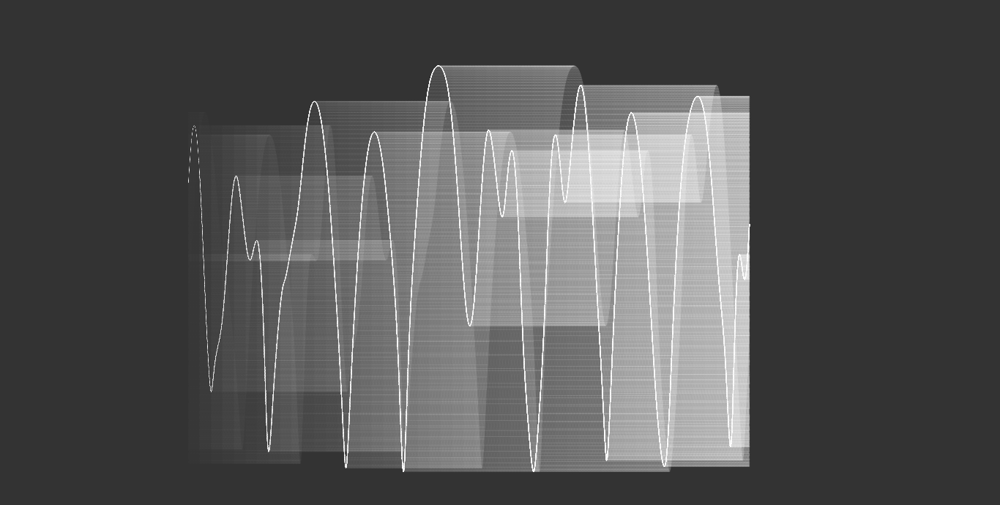

# double-pendulum
Double pendulum simulation written in JS + P5

Ever wanted to play with a double pendulum?

The equations were derived using Lagrangian mechanics. This may be changed to Newtonian mechanics to allow for multiple pendulums.

Check it out [here](http://jamiejquinn.com/double-pendulum/)

## Pictures

